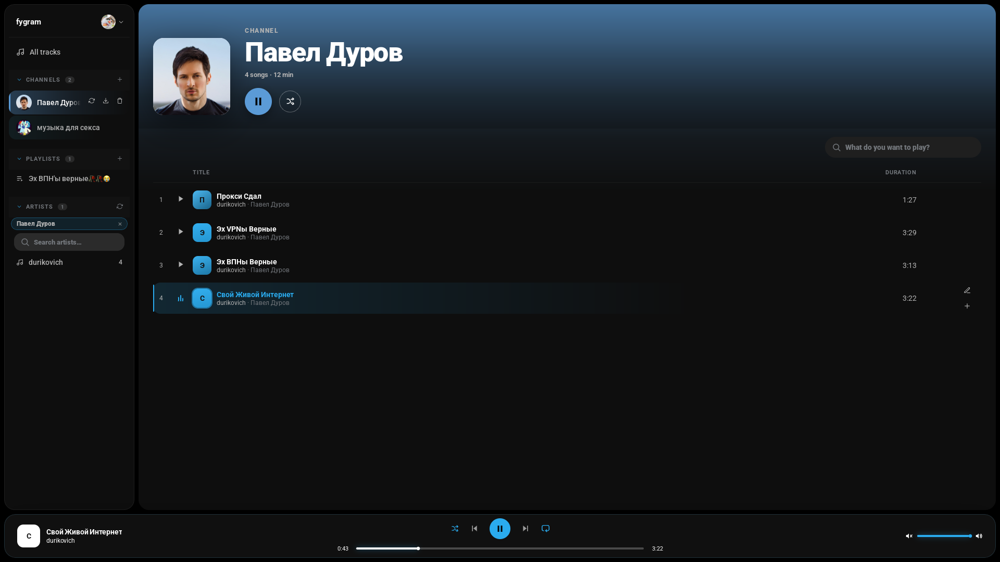
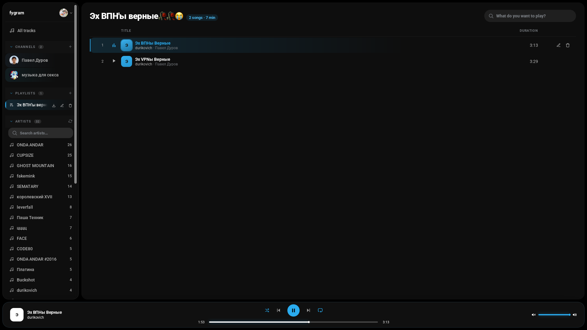
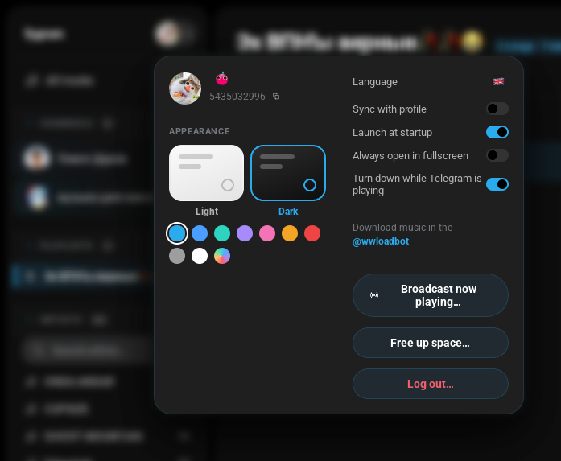

<div align="center">

**english** · [русский](README.ru.md)


# fygram

**your telegram channels, as a music library.**

indexes the audio in the channels you add, downloads each track once,
plays it offline. playlists, search, now playing in your profile.

### [⬇ download the latest release](https://github.com/amoyrlet-tg/fygram/releases/latest)

[](https://github.com/amoyrlet-tg/fygram/releases/latest)
[](https://github.com/amoyrlet-tg/fygram/releases)
[](https://t.me/amoyrlet)
[](https://github.com/amoyrlet-tg/fygram/stargazers)

every build for every platform lives on the
[releases page](https://github.com/amoyrlet-tg/fygram/releases/latest):
appimage, deb, dmg, exe, msi.

<br />



<sub>a channel you added, with every track it ever posted</sub>

</div>

<table>
<tr>
<td width="56%" valign="top">

<p align="center"><sub><b>playlists</b>, built from tracks across all of your channels</sub></p>
</td>
<td width="44%" valign="top">

<p align="center"><sub><b>light and dark</b>, your accent colour, five languages, launch at startup</sub></p>
</td>
</tr>
</table>

---

## why

telegram is where my music lives, and telegram gives you exactly one way through
it: scroll. a channel is a wall of files, newest on top. no playlists, no
artists, none of what anything calling itself a music app would have.

so, fygram.

point it at a channel and you get a library of every song ever posted there.
each file is fetched once, kept in whatever format it arrived in, and plays with
the network off.

- playlists that pull from every channel at once
- one search box over the entire library
- nothing of mine in the middle: your saved messages are what carries
  playlists between devices
- whatever is playing shows up on your telegram profile
- the volume drops by itself when telegram, or a fork of it, starts talking

## get it

### arch

it lives in the AUR, so it updates along with everything else:

```sh
yay -S fygram-bin
```

### everywhere else

one file off the [releases page](https://github.com/amoyrlet-tg/fygram/releases/latest):

- **linux** — take the `.AppImage`, right click → properties → tick _allow
  executing_. on debian, ubuntu and mint the `.deb` is less fuss: double click
  and it lands in the menu
- **macos** — the `.dmg`, drag fygram into applications. a single universal
  build covers apple silicon and intel
- **windows** — the `.exe`, run it

expect a fight on the way in: smartscreen on windows, _the app is damaged_ on
macos. nothing is wrong with the build, it simply is not signed — a signature
costs money i have not spent on this. windows: **more info → run anyway**.
macos, once:

```sh
xattr -dr com.apple.quarantine /Applications/fygram.app
```

## first run

there is no fygram server. the app talks to telegram itself, and for that it
needs api keys of your own. [my.telegram.org/apps](https://my.telegram.org/apps)
hands them out in a minute — call the app whatever you like — then paste
**api_id** and **api_hash** into fygram. they say which app is knocking, not who
you are, and they never leave your disk.

after that, drop in a channel link and watch the library build itself.

## contact

anything at all, telegram [@amoyrlet](https://t.me/amoyrlet)

## support

a ⭐ is how other people find this. and if you would rather send a coin,
ton/btc/trx/cryptobot are in [my bio](https://amoyrlet-tg.github.io/#donations)

## credits

- [grammers](https://codeberg.org/Lonami/grammers) — Lonami's mtproto client; without it there is no app
- [tauri](https://github.com/tauri-apps/tauri) and [react](https://github.com/facebook/react) — the shell and the interface
- [rodio](https://github.com/RustAudio/rodio) with [symphonia](https://github.com/pdeljanov/Symphonia) — playback and decoding
- [lofty](https://github.com/Serial-ATA/lofty-rs) — reads the tags off every file
- [motion](https://github.com/motiondivision/motion) — everything that moves
- [sqlx](https://github.com/launchbadge/sqlx) over [sqlite](https://www.sqlite.org) — where the library lives

---

<div align="center">

[apache-2.0](LICENSE) · optional "broadcast now playing" is documented in [BROADCAST.md](BROADCAST.md)

</div>
